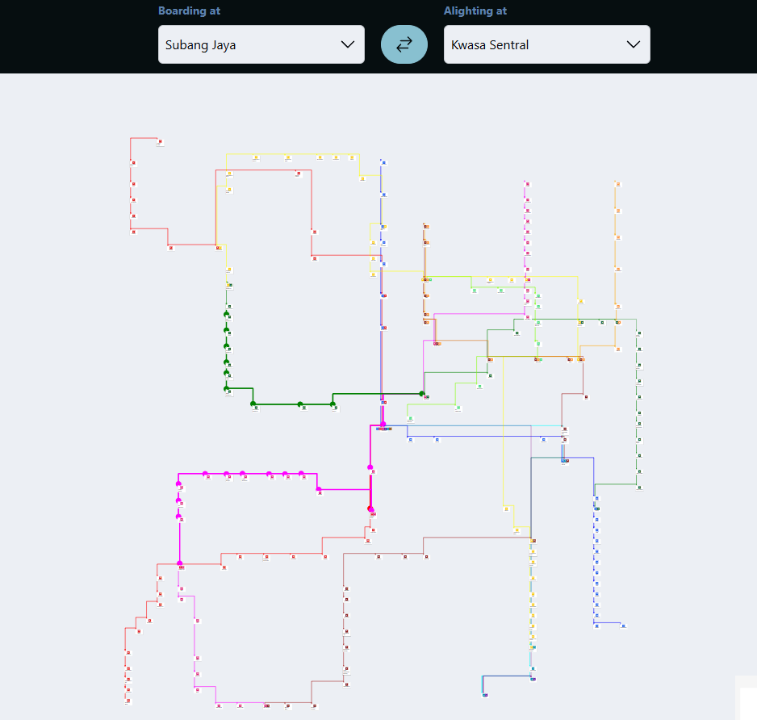

# MRT Pathfinding Visualization

This project is a pathfinding visualization tool for MRT systems, inspired by heuristic search algorithms such as **A\*** and **Dijkstra**. The tool uses the MyRapid KL MRT system as its base and allows users to visualize stations, lines, and optimal paths between them.

---

## Table of Contents

- [Introduction](#introduction)
- [Features](#features)
- [Technologies Used](#technologies-used)
- [Setup and Installation](#setup-and-installation)
- [Graph Construction](#graph-construction)
  - [Node and Edge Generation](#node-and-edge-generation)
  - [Challenges Faced](#challenges-faced)
- [Pathfinding Algorithms](#pathfinding-algorithms)
  - [A\* Algorithm](#a-algorithm)
  - [Heuristic Calculation](#heuristic-calculation)
- [Acknowledgements](#acknowledgements)
- [License](#license)

---

## Introduction

This project visualizes the MRT stations of MyRapid KL, demonstrating pathfinding algorithms with accurate representations of station interconnections. The idea was inspired by a similar project utilizing MRT stations in Singapore and focuses on manually constructing nodes and edges to replicate the MyRapid KL system. </br>

Link to Project - https://zuhu162.github.io/AStar-MRT-PathFinder/

References - </br>
https://www.youtube.com/watch?v=QXQ4iD4UXOE&t=1s
https://www.youtube.com/watch?v=aKYlikFAV4k&t=789s </br>
https://www.youtube.com/watch?v=i0x5fj4PqP4



---

## Features

- **Node and Edge Visualization**: Dynamically generated nodes (stations) and edges (connections) using JSON data.
- **Pathfinding Algorithm**: Implementation of A\* algorithm to find the fastest path between two stations based on travel time.
- **Interactive Interface**: A map-like UI resembling the real MRT system.
- **Dynamic Edge Creation**: Automated edge generation based on station connections, minimizing manual effort.

---

## Technologies Used

- **React.js**: Frontend framework for building the user interface.
- **React Flow**: Library for rendering nodes and edges.
- **JavaScript/TypeScript**: Programming languages for the logic and algorithms.
- **Image Editing Tools**: Used to grid and map station positions.

---

## Setup and Installation

1. Clone the repository:
   ```bash
   git clone https://github.com/Zuhu162/AStar-MRT-PathFinder.git
   cd AStar-MRT-PathFinder
   ```
2. Install dependencies:
   ```bash
   npm install
   ```
3. Start the development server:
   ```bash
   npm run dev
   ```
4. Open the application in your browser at `http://localhost:5173`.

---

## Graph Construction

### Node and Edge Generation

#### Steps

1. Plotted each MRT station manually:

   - Used an MRT map image, reduced its opacity in an image editing tool, and overlaid a grid.
   - Extracted each station's data (coordinates, connections) into a JSON format compatible with React Flow.

   Example node data:

   ```json
   {
     "id": "titiwangsa",
     "connectedStations": ["batuCaves", "station2"],
     "data": {
       "label": "Titiwangsa",
       "lines": [
         { "color": "yellow", "stationNumber": 17 },
         { "color": "brown", "stationNumber": 4 },
         { "color": "orange", "stationNumber": 3 },
         { "color": "chartreuse", "stationNumber": 11 }
       ],
       "connectedStations": [
         { "id": "sentulBarat", "time": 2 },
         { "id": "hospitalKualaLumpur", "time": 2 },
         { "id": "sentul-SentulTimur", "time": 2 },
         { "id": "pwtc", "time": 2 },
         { "id": "chowKit", "time": 3 }
       ]
     },
     "position": { "x": 6900, "y": 3000 }
   }
   ```

2. Automated edge creation using a function:
   - Each station lists its connected stations.
   - Edges are generated dynamically, avoiding duplicates:
     ```tsx
     if (node.id < connectedStation) {
       edges.push({
         id: `${node.id}-${connectedStation}`,
         source: node.id,
         target: connectedStation,
         type: "line",
       });
     }
     ```

### Challenges Faced

1. **Edge Duplication**:

   - Edges were created twice (e.g., A-B and B-A).
   - Fixed using an `if` condition to compare IDs.

2. **Interchange Stations**:

   - Stations connected by multiple lines caused overlapping edges.
   - Ensured correct line and handle connections using station IDs and line-specific rules.

3. **Path Visualization**:
   - Ensured that lines followed their respective colors and avoided overlapping edges.

---

## Pathfinding Algorithms

### A\* Algorithm

The A\* algorithm determines the shortest path by combining:

- **g(n)**: Cost to travel from the start node to the current node.
- **h(n)**: Estimated cost to travel from the current node to the target node (heuristic).

**Formula**:

```text
f(n) = g(n) + h(n)
```

### Heuristic Calculation

The heuristic uses the Euclidean distance between the current node and the target node:

```tsx
const calculateHeuristic = (currentNode, targetNode) => {
  const dx = currentNode.position.x - targetNode.position.x;
  const dy = currentNode.position.y - targetNode.position.y;
  return Math.sqrt(dx * dx + dy * dy);
};
```

### Open and Closed Sets

- **Open Set**: Nodes yet to be fully explored.
- **Closed Set**: Nodes already evaluated.

## Acknowledgements

- Inspired by the pathfinding project for Singapore MRT.
- Special thanks to online tutorials and resources on A\* and graph algorithms.

---

## License

This project is licensed under the MIT License. See the `LICENSE` file for details.

---

Feel free to contribute or raise issues in the [Issues](https://github.com/zuhu162/AStar-MRT-PathFinder/issues) section!
